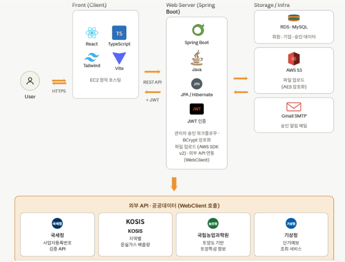

# 🌳 GROOT

> **기업 ESG 실천을 위한 탄소중립 수목 관리 플랫폼**

지역 기후와 토양 데이터를 기반으로 최적 수종을 추천하고,
기업의 탄소흡수량을 과학적으로 측정·예측하여 **친환경 인증마크**를 발급하는 서비스입니다.

---

## 📖 1. 프로젝트 소개

### 프로젝트 이름
**GROOT** — 기업 ESG 탄소중립 플랫폼

### 한 줄 설명
**"기업의 탄소 상쇄 활동을 데이터 기반으로 추천·측정·인증하는 플랫폼"**

### 개발 목적 / 배경

- 🌍 **2050 탄소중립**과 ESG 경영 확산에도, 기업의 나무 심기 활동은 **정량적 인증 수단과 사후 관리 체계가 부재**한 실정
- 🌱 **수종·크기별 탄소흡수량 차이**가 최대 수십 배에 달하지만, 국립산림과학원 공인 탄소계수를 활용한 기업용 서비스는 전무
- 📊 기업이 ESG 보고서·탄소 크레딧으로 연계하려면 **신뢰할 수 있는 제3자 검증 데이터**가 필요하나 관련 플랫폼 인프라 부재
- ✅ **GROOT**은 식재 수목의 위치·수종·흉고직경(DBH)을 현장 답사로 실측하고, **산림과학원 공인 계수 기반**으로 탄소흡수량을 정량 계산·인증하는 플랫폼

---

## 👥 2. 팀원 / 역할

| 팀원 | 담당 영역 | 주요 역할 |
|:---:|:---|:---|
| **한승** | 🔐 **회원 · 인프라** | • 회원 및 기업 관리<br>• JWT 기반 로그인/인증<br>• AWS 클라우드 배포 |
| **도경** | 📋 **답사 · 배정** | • 답사 신청 및 전문가 관리<br>• 관리자 승인/반려 로직<br>• 전문가 자동 배정 트리거 |
| **태형** | 📐 **현장 · 측정** | • 현장 보고서 및 나무 측정<br>• 탄소흡수량 계산 로직<br>• 좌표 기반 위치 매핑 |
| **성은** | 🌳 **추천 · 인증** | • 수목 추천 알고리즘<br>• 탄소흡수량 계산 및 예측<br>• 인증마크 시스템<br>• 외부 API 연동 |

---

## 🛠 3. 기술 스택

### 🖥 Backend


### 💻 Frontend


### 🌐 외부 API
| API | 제공처 | 용도 |
|:---|:---|:---|
| **사업자번호 검증 API** | 국세청 | 기업 회원가입 시 사업자 진위 확인 |
| **지역별 온실가스 배출량 API** | KOSIS (통계청) | 지역 탄소 배출 데이터 조회 |
| **토양도 기반 토양특성 상세정보 API** | 농촌진흥청 (국립농업과학원) | 배수등급·토심·토성 등 토양 정보 |
| **기상청 단기예보 조회서비스** | 기상청 | 지역별 실시간 기온·습도 조회 |

---

## ✨ 4. 주요 기능

### 🔐 회원 · 인증
- **사업자번호 검증**을 통한 **기업 회원가입** (국세청 API 연동)
- **JWT 기반 로그인**으로 안전한 인증 흐름
- **경력증명서 PDF 업로드** 후 관리자 승인 절차
- **이메일(SMTP)** 을 활용한 인증마크 발급 알림

### 📋 답사 신청 · 자동 배정
- 기업이 원하는 **날짜·지역**을 선택해 답사 신청
- 관리자의 **승인/반려** 처리 후 전문가 **자동 배정**
  - **1단계**: 기업 주소 기준 동일 시(市) 소속 전문가 우선 매칭
  - **2단계**: Haversine 공식으로 **가장 가까운 거리**의 전문가 배정
  - **일정 충돌 자동 회피** (이미 배정된 전문가 제외)

### 📐 현장 보고서 · 측정
- 현장 답사 후 전문가가 **수목 측정 데이터** 입력
  - 흉고직경(DBH), 수고, 위치 좌표 등
- **산림과학원 논문 기반 상대생장식(W = a × D^b)** 적용
- 실측 데이터 기반 **탄소흡수량(CO₂) 자동 산출**

### 🌳 수목 추천 알고리즘
- 기업이 **지역·면적·희망 수량**을 입력하면 22종 중 **최적 수종 TOP 3 추천**
- **100점 만점 4단계 점수화**:

  | 평가 항목 | 배점 | 평가 기준 |
  |:---|:---:|:---|
  | 🌱 탄소흡수력 | 35점 | 상대생장식 기반 연간 CO₂ 흡수량 |
  | 🪴 토양적합도 | 30점 | 흙토람 API × 수종별 선호 범위 매칭 |
  | 🌤 날씨적합도 | 20점 | 기상청 API × 수종 분류별 최적 범위 |
  | 📏 면적적합도 | 15점 | 식재 간격 기반 적정 밀도 판정 |

- **보정 탄소흡수량** 제공 (토양·날씨 환경 반영)

### 📊 탄소흡수량 예측
- **년도별 탄소흡수량 예측**
- **수종별 성장 곡선** 반영 상대생장식 적용
- 기업별 **누적 탄소 상쇄 실적** 관리

### 🏆 인증마크 시스템
- 누적 탄소흡수량 기준 **등급별 인증마크 자동 발급** (Bronze → Silver → Gold → Platinum)
- **이메일 자동 발송** 및 다운로드 가능
- 기업 홍보/ESG 보고서에 활용 가능

### 👨‍💼 관리자 대시보드
- 회원·기업 승인 관리
- 답사 신청 전체 현황 조회
- 전문가 수동 배정 기능
- **지역별 탄소 배출량 통계** 시각화 (KOSIS 연동)

---

## 🏗 5. 서비스 아키텍처

<div align="center">



</div>

### 🔹 아키텍처 구성

| 계층 | 구성 요소 | 역할 |
|:---|:---|:---|
| **Front (Client)** | React · TypeScript · Tailwind · Vite | EC2 정적 호스팅, HTTPS 통신 |
| **Web Server** | Spring Boot · Java · JPA/Hibernate · JWT | REST API 제공, 관리자 워크플로우, BCrypt 암호화, WebClient 외부 API 연동 |
| **Storage / Infra** | RDS(MySQL) · AWS S3 · Gmail SMTP | 회원·기업·승인 데이터 저장, 파일 업로드(AES 암호화), 승인 알림 메일 발송 |
| **외부 API** | 국세청 · KOSIS · 농촌진흥청 · 기상청 | 사업자번호 검증, 지역별 온실가스 배출량, 토양특성 정보, 단기예보 조회 |

### 🔹 데이터 흐름
```
User → (HTTPS) → Front(EC2) → (REST API + JWT) → Spring Boot
                                                      ↓
                                    ┌─────────────────┼─────────────────┐
                                    ↓                 ↓                 ↓
                                RDS·MySQL         AWS S3           Gmail SMTP
                                                      ↓
                                              외부 API · 공공데이터
                                            (WebClient 호출)
```

---

## 🎬 6. 시연 영상

<div align="center">

[](https://drive.google.com/file/d/1kVpLUwoW3PDe0-Ms-aDT4NnmZlo_zkBP/view?usp=drive_link)

**▶ 시연 영상 바로가기**: [Google Drive Link](https://drive.google.com/file/d/1kVpLUwoW3PDe0-Ms-aDT4NnmZlo_zkBP/view?usp=drive_link)

</div>

---

## 🔗 7. 참고 링크

> 📌 아래 링크는 모두 **읽기 모드**로 공유됩니다.

| 구분 | 링크 |
|:---|:---|
| 🍃 **Spring Git Repository** | [바로가기](https://github.com/Sungeun0318/backend-GROOT) |
| ⚛️ **React Git Repository** | [바로가기](https://github.com/Sungeun0318/frontend-GROOT) |
| 📘 **API 명세서** | [바로가기](https://docs.google.com/spreadsheets/d/1xVxkpwKqpttQIUuTQO0vhLukkjsdJBzUty1dBmZBa58/edit?gid=1597508774#gid=1597508774) |
| 🎨 **디자인 (Figma)** | [바로가기](https://www.figma.com/design/cmXoECDkfEzd0MU8aLxeoI/%EC%A0%9C%EB%AA%A9-%EC%97%86%EC%9D%8C?node-id=0-1&t=VFnyYCv1T9LEqToH-1) |
| 📊 **PPT · Canva** | [바로가기](https://canva.link/t88zaannn9vftfh) |

---

<div align="center">

**🌏 지속 가능한 미래를 위한 한 그루의 시작, GROOT 🌏**

</div>
